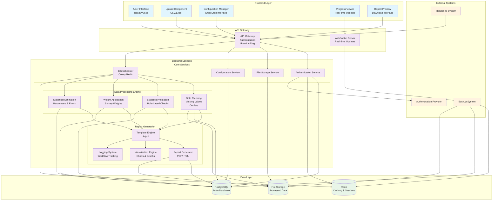
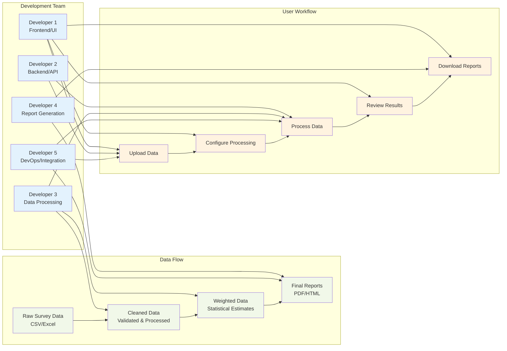
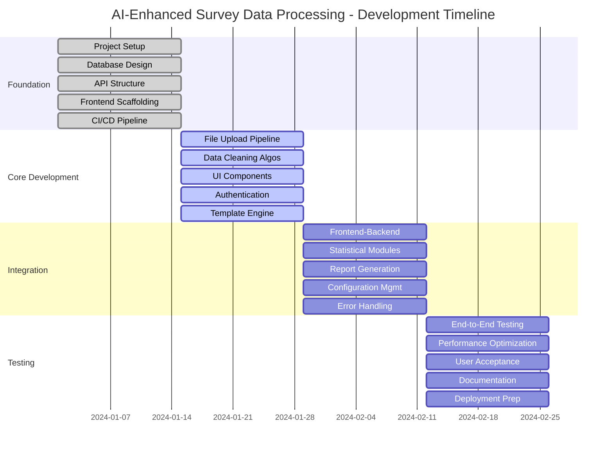

# AI-Enhanced Survey Data Processing Application - Project Plan

## Executive Summary
Development plan for building an AI-augmented web application that automates survey data preprocessing, statistical estimation, and report generation for official statistical agencies.

## Meta-Analysis of Requirements

### Core Problem Statement
- **Challenge**: Manual survey data workflows are laborious, error-prone, and methodologically inconsistent
- **Solution**: Low-code, AI-enhanced tool for streamlined data processing and analysis
- **Target Users**: Statistical agencies and survey data analysts
- **Expected Impact**: Accelerated survey readiness, reduced errors, enhanced reproducibility

### Technical Architecture Overview
```
Frontend (React/Vue) ↔ API Gateway ↔ Backend Services ↔ Database
                                   ↔ Data Processing Engine
                                   ↔ Report Generation Service
```

#### System Architecture Diagram



#### Team Structure & Data Flow



#### Development Timeline



## 5-Developer Team Structure & Responsibilities

### Developer 1: Frontend/UI Developer
**Primary Focus**: User interface and user experience

**Core Responsibilities**:
- [ ] Design responsive web application interface
- [ ] Implement file upload component (CSV/Excel)
- [ ] Create schema mapping interface (drag-drop or JSON config)
- [ ] Build data preview and validation screens
- [ ] Develop configuration panels for cleaning modules
- [ ] Implement progress tracking and workflow visualization
- [ ] Create report preview and download interface
- [ ] Add tooltips, help text, and error messaging
- [ ] Ensure accessibility compliance
- [ ] Mobile responsiveness optimization

**Technical Stack**: React/Vue.js, TypeScript, Material-UI/Ant Design, Chart.js/D3.js

**Key Deliverables**:
- [ ] Interactive data upload wizard
- [ ] Configuration dashboard
- [ ] Real-time processing status display
- [ ] Report generation interface
- [ ] User guidance system (tooltips, inline help)

### Developer 2: Backend/API Developer
**Primary Focus**: Core application logic and API services

**Core Responsibilities**:
- [ ] Design RESTful API architecture
- [ ] Implement authentication and authorization
- [ ] Create file upload and processing endpoints
- [ ] Build configuration management system
- [ ] Develop job queue and processing pipeline
- [ ] Implement error handling and logging
- [ ] Create data validation endpoints
- [ ] Build report generation API
- [ ] Database schema design and optimization
- [ ] API documentation with OpenAPI/Swagger

**Technical Stack**: Python/Django or Node.js/Express, PostgreSQL/MongoDB, Redis, Celery

**Key Deliverables**:
- [ ] Complete API specification
- [ ] Authentication system
- [ ] File processing pipeline
- [ ] Configuration management service
- [ ] Job monitoring and status tracking

### Developer 3: Data Processing/Statistics Engineer
**Primary Focus**: Statistical algorithms and data cleaning modules

**Core Responsibilities**:
- [ ] Implement missing value imputation algorithms (mean, median, KNN)
- [ ] Develop outlier detection methods (IQR, Z-score, winsorization)
- [ ] Create rule-based validation system
- [ ] Build survey weight application logic
- [ ] Implement statistical estimation methods
- [ ] Develop margin of error calculations
- [ ] Create data quality assessment metrics
- [ ] Build configurable cleaning pipeline
- [ ] Implement data transformation utilities
- [ ] Ensure statistical accuracy and validation

**Technical Stack**: Python, Pandas, NumPy, SciPy, Scikit-learn, Statsmodels

**Key Deliverables**:
- [ ] Data cleaning module library
- [ ] Statistical estimation engine
- [ ] Weight application system
- [ ] Validation and quality assessment tools
- [ ] Algorithm configuration system

### Developer 4: Report Generation/Template Engine Developer
**Primary Focus**: Automated report creation and template system

**Core Responsibilities**:
- [ ] Design template engine architecture
- [ ] Implement PDF report generation
- [ ] Create HTML report templates
- [ ] Build dynamic chart and visualization system
- [ ] Develop workflow logging system
- [ ] Create diagnostic report components
- [ ] Implement template customization interface
- [ ] Build report scheduling system
- [ ] Create export functionality (multiple formats)
- [ ] Ensure report accessibility and standards compliance

**Technical Stack**: Python, ReportLab/WeasyPrint, Jinja2, Plotly/Matplotlib, HTML/CSS

**Key Deliverables**:
- [ ] Template management system
- [ ] PDF/HTML report generators
- [ ] Visualization library
- [ ] Diagnostic and workflow logging
- [ ] Export and scheduling system

### Developer 5: DevOps/Integration Engineer
**Primary Focus**: Deployment, monitoring, and system integration

**Core Responsibilities**:
- [ ] Set up development and production environments
- [ ] Implement CI/CD pipeline
- [ ] Configure monitoring and logging systems
- [ ] Set up database and caching infrastructure
- [ ] Implement security measures and compliance
- [ ] Create backup and disaster recovery systems
- [ ] Performance optimization and scaling
- [ ] Integration testing framework
- [ ] Documentation and deployment guides
- [ ] System health monitoring

**Technical Stack**: Docker, Kubernetes/Docker Compose, GitHub Actions/Jenkins, Nginx, PostgreSQL, Redis

**Key Deliverables**:
- [ ] Containerized application deployment
- [ ] CI/CD pipeline
- [ ] Monitoring dashboard
- [ ] Security implementation
- [ ] Performance optimization

## Development Timeline (8-Week Sprint)

### Week 1-2: Foundation & Setup
- [ ] Project initialization and environment setup
- [ ] Database schema design
- [ ] Basic API structure
- [ ] Frontend project scaffolding
- [ ] CI/CD pipeline setup

### Week 3-4: Core Development
- [ ] File upload and processing pipeline
- [ ] Data cleaning algorithms implementation
- [ ] Basic UI components
- [ ] Authentication system
- [ ] Template engine foundation

### Week 5-6: Integration & Advanced Features
- [ ] Frontend-backend integration
- [ ] Statistical estimation modules
- [ ] Report generation system
- [ ] Configuration management
- [ ] Error handling and validation

### Week 7-8: Testing & Optimization
- [ ] End-to-end testing
- [ ] Performance optimization
- [ ] User acceptance testing
- [ ] Documentation completion
- [ ] Deployment preparation

## Technical Requirements Checklist

### Data Input & Configuration
- [ ] CSV/Excel file upload with size limits
- [ ] Schema mapping interface (UI-based)
- [ ] JSON configuration import/export
- [ ] Data preview functionality
- [ ] Column type detection and validation

### Data Cleaning Modules
- [ ] Missing value imputation (mean, median, KNN)
- [ ] Outlier detection (IQR, Z-score, winsorization)
- [ ] Rule-based validation (consistency checks, skip patterns)
- [ ] Configurable cleaning workflows
- [ ] Data quality assessment reports

### Weight Application
- [ ] Design weight application
- [ ] Weighted summary statistics
- [ ] Unweighted summary statistics
- [ ] Margin of error calculations
- [ ] Population parameter estimation

### Report Generation
- [ ] Template-based report creation
- [ ] PDF export functionality
- [ ] HTML report generation
- [ ] Workflow logging and diagnostics
- [ ] Data visualizations and charts

### User Experience
- [ ] Intuitive drag-and-drop interface
- [ ] Progress indicators and status updates
- [ ] Tooltips and inline help
- [ ] Error messages and validation alerts
- [ ] Responsive design

## Integration Points & Dependencies

### Critical Integration Points
1. **File Upload → Data Processing**: Seamless handoff from frontend upload to backend processing
2. **Configuration → Processing Engine**: Dynamic configuration application to cleaning algorithms
3. **Processing → Report Generation**: Processed data integration with template system
4. **Real-time Updates**: WebSocket connections for progress tracking
5. **Error Handling**: Comprehensive error propagation across all layers

### External Dependencies
- [ ] Statistical validation datasets
- [ ] PDF report templates
- [ ] Survey methodology documentation
- [ ] Government compliance requirements

## Success Metrics
- [ ] Processing speed: <5 minutes for typical survey datasets
- [ ] Accuracy: 99%+ consistency with manual processing
- [ ] Usability: Non-technical users can complete workflows independently
- [ ] Reliability: 99.9% uptime and error-free processing
- [ ] Scalability: Handle multiple concurrent processing jobs

## Risk Mitigation
- [ ] Regular code reviews and pair programming
- [ ] Automated testing at all levels
- [ ] Progressive deployment strategy
- [ ] Performance monitoring and alerting
- [ ] Backup and rollback procedures

## Bonus Features (If Time Permits)
- [ ] Interactive dashboards for data exploration
- [ ] Audit trails for regulatory compliance
- [ ] Multi-language support
- [ ] Advanced visualization options
- [ ] API integration for external systems